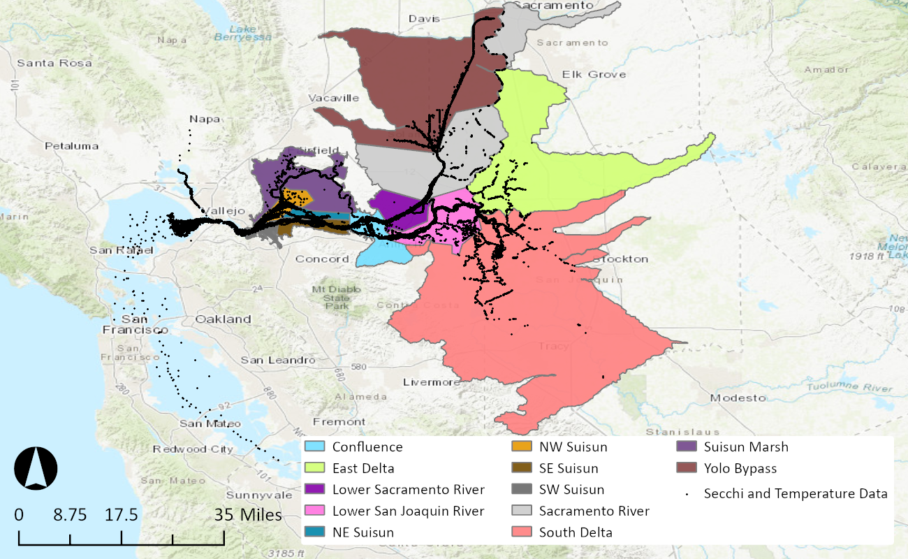

# Secchi and Temperature Data

## Obtain Secchi and Temperature Data in the Delta
TODO Sadie add details
[deltareportr](https://github.com/sbashevkin/deltareportr)

## Digitize Strata and Join to Secchi and Temperature Data
The secchi and temperature data points were assigned their respective strata. This was achieved by digitizing the strata and joining the strata to the data. The strata was referenced from Fig. 2.3.2 from the report "Structured Decision Making for Scientific Management in the San Francisco Bay-Delta" (Peterson et al 2019). 

First, a suitable watershed shapefile was identified that closely matched the inferred strata boundaries. The "WBDHU10" shapefile from "USGS National Watershed Boundary Dataset in FileGDB 10.1 format (published 20190628)" was utilized as the template to begin digitizing the strata. This shapefile corresponds to the USGS 5th level watershed classification that has a 10-digit hydrologic unit code. Using the boundaries delineated by the colored streams in Fig. 2.3.2 as a reference, the watershed shapefile was further delineated by splitting regions in GIS to represent the strata. The strata shapefile was used solely for the purpose of the spatial join and did not accurately represent watershed boundaries.

The map horizontal coordinate system was set to WGS 1984. The secchi and temperature data was then imported into GIS as point objects to visualize the locations based on the longitude and latitude attributes. Thes strata were spatially joined to each data point that fell within the corresponding strata boundaries. The joined data was then exported to a CSV file.

